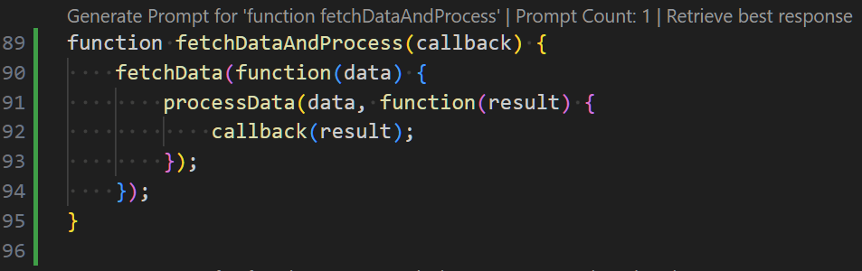
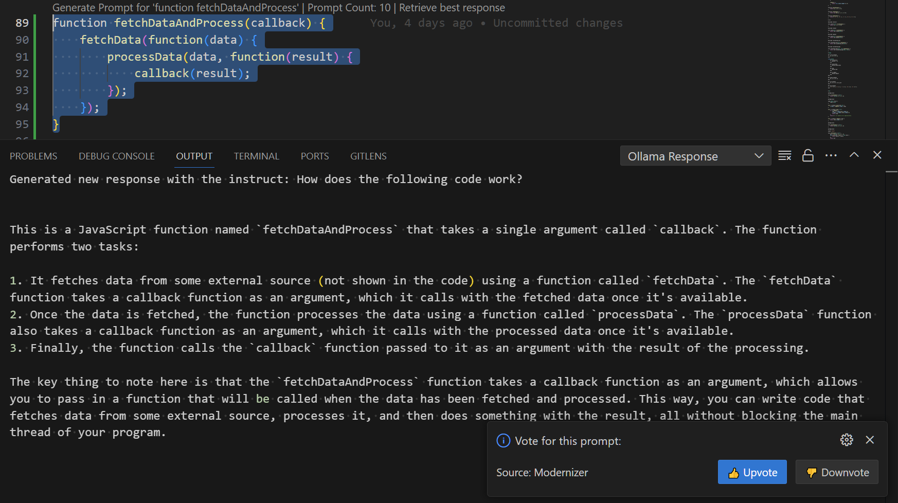
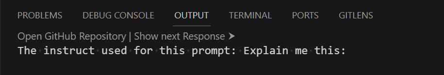
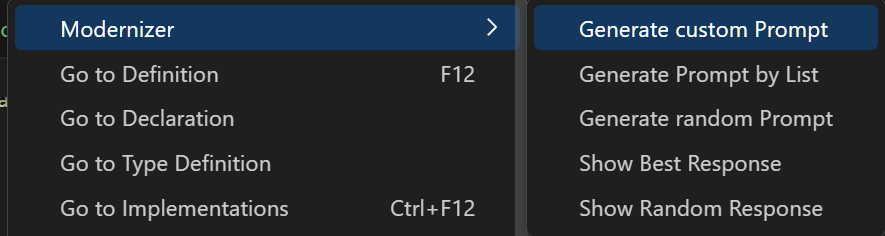

# modernizer

A bachelor thesis project to enhance legacy software modernization via LLMs

## Prerequisites:

- git client
- Visual Studio Code

## Installation:

### Option 1: Command Line
```shell
 code --install-extension IlijaKovacevic.modernizer-vscode
```

### Option 2: Visual Studio Code

1. Open **Extensions** sidebar panel in Visual Studio Code. `View → Extensions`
2. Search for `modernizer`
3. Click **Install** to install it

### Option 3: Packaged VSIX Extension

1. Download the latest release from the [GitHub releases page](https://github.com/rwth-acis/modernizer/releases/tag/v1.2.0)
2. Install it from the command line with `code --install-extension modernizer-1.2.0.vsix`

### Option 4: Compile from Source

1. Clone the repository: `git clone https://github.com/rwth-acis/modernizer.git`
2. Open the subfolder `extension` in Visual Studio Code
3. Run `npm install` to install the dependencies
4. Press `F5` to start a new window with the extension loaded

## Usage:

In order to showcase the functionalities a repository is prepared with a few examples. The repository can be found [here](https://github.com/ili16/example-functions.git).

- Clone the repository: `git clone https://github.com/ili16/example-functions.git`
- Change to the repository directory: `cd example-functions`
- Open the repository in Visual Studio Code with all extensions disabled except for the modernizer extension:
    - Windows: `& code . ($(& code --list-extensions | Where-Object { $_ -ne 'ilijakovacevic.modernizer-vscode' } | ForEach-Object { "--disable-extension" ; $_ }) )`
    - Linux: `code . $(code --list-extensions | grep -v 'ilijakovacevic.modernizer-vscode' | sed 's/^/--disable-extension /' | tr '\n' ' ')
      `

## Features:

The extension provides CodeLenses in the active editor window:



- **Generate Prompt for ...** - Generates a prompt with a random instruct for the selected function
- **Prompt Count** - Shows the number of prompts for functions with the same name
- **Retrieve best response** - Retrieves the best response for the selected prompt

Generated or retrieved prompts are displayed in the output window with a notification to either up- or downvote that response:



When retrieving responses additional CodeLenses are provided:



- **Open GitHub Repository** - Opens the file and lines of code which were used to generate the prompt
- **Show next Response** - Shows the next response for the initially selected code

One can also use the context menu to access the functionalities:

 

## Uninstall

The backend won't be available for future use so you can uninstall the extension by following the steps below:

### Option 1: Command Line

```shell
 code --uninstall-extension IlijaKovacevic.modernizer-vscode
```

### Option 2: Visual Studio Code

1. Open **Extensions** sidebar panel in Visual Studio Code. `View → Extensions`
2. Search for `modernizer`
3. Click **Uninstall** to uninstall it

